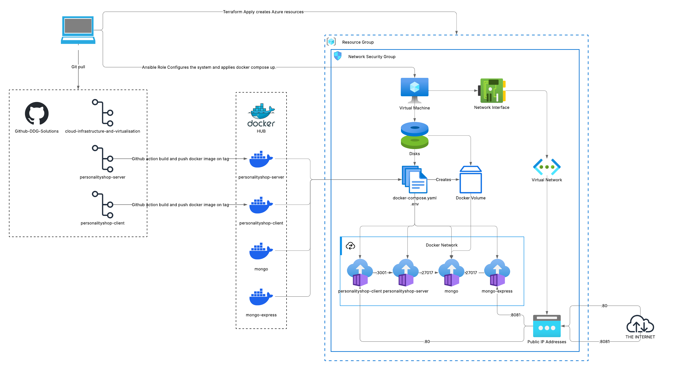

# Cloud Infrastructure and Virtualisation - Project Report

## Assignment Cover Sheet

| Student Names       | Student Numbers |
| ------------------- | --------------- |
| Daniel Stuart Kelly | 20094266        |
| Donal Gallery       | 20093916        |
| Gustavo Brito       | 20093035        |

**Programme**: Higher Diploma in Science in Computing - Full Time Yr1 (Sept 2025 Intake)

**Lecturer Name**: Paul Laird

**Module/Subject Title**: B8IS003 – Cloud Infrastructure and Virtualisation

**Assignment Title**: CA_TWO

**Assignment GitHub Repository**: [https://github.com/DDG-Solutions/cloud-infrastructure-and-virtualisation](https://github.com/DDG-Solutions/cloud-infrastructure-and-virtualisation)

**Related GitHub Repositories**

- [https://github.com/DDG-Solutions/PersonalityShop-Client](https://github.com/DDG-Solutions/PersonalityShop-Client)
- [https://github.com/DDG-Solutions/PersonalityShop-Server](https://github.com/DDG-Solutions/PersonalityShop-Server)

> Note, above are private GitHub Repositories, please provide your GitHub username and we can share it with you on request.

## 1. Introduction

This project is our submission for the **Cloud Infrastructure and Virtualisation** Module in Dublin Business School.

In our Web and Cloud Application Development module, we created **The Personality Shop** a full-stack e-commerce web application with React, MaterialUI on the frontend, Node.js and Express for the backend, and MongoDB for the database.
Instead of a typical website, selling typical products, we wanted to do something imaginative and comic. We created a store selling personality traits like good craic, kindness and shamelessness.

For this project, the brief was to take an application, containerise it with a Dockerfile(s), orchestrate it using docker-compose or another platform and build the associated resources and deploy it to a private cloud.

As per the assignment brief, this was initially intended to be run in a private cloud on-premise. However, the resources for this were not available and we were approved to deploy to Azure instead. We have used the Azure for Students subscription kindly provided by DBS. Even though we have deployhed to a different "cloud" we have used Terraform for all of our infrastructure provisioning, which means the same approach will apply to VMWare or any other supported platform, we just need to change out the provider.

## 2. Private Cloud Plan and Design

### 2.1 Requirements Analysis

Our Personality Shop required an environment capable of running three docker containers with the following needs:

- **Compute**: A Linux virtual machine with sufficient resources.
- **Networking**: A virtual network with a public IP for external access, and internal container networking for communication between the three services.
- **Storage**: Persistent storage for MongoDB data to survive container instability or restarts.
- **Security**: Restricted inbound access using Security Groups, SSH key-based authentication, sensitive configuration managed through environment variables.

### 2.2 Technology Justification

We selected the following technologies for our infrastructure:

- **Microsoft Azure** - Our team had access to Azure student credits from previous modules.
- **Terraform** - An industry-standard Infrastructure as Code (IaC) tool that allows us to define our Azure infrastructure declaratively. Terraform ensures our environment is reproducible. Keeping the Terraform code and state files in git ensures that it is version-controlled.
- **Ansible** - A configuration management tool used to automate the installation of Docker and its dependencies, and the management of the docker-compose file on the provisioned VM. Also kept in git to ensure that any changes can be tracked and audited if required Ansible connects over SSH and requires no agent on the target machine, making it lightweight and well-suited to our setup.
- **Docker and Docker Compose** - Docker containerises our application components, while Docker Compose handles multi-container orchestration, networking, volumes and dependency management. Docker compose is managed by Ansible community.docker.docker_compose_v2 module.

### 2.3 Architecture

Our architecture follows a three-layer approach: infrastructure provisioning, configuration management, and application deployment.

Terraform provisions the Azure resources: a resource group, virtual network, subnet, network security group, public IP, network interface, and an Ubuntu 24.04 LTS virtual machine in the France Central region. Terraform also generates an Ansible inventory file as an output, linking the provisioning and configuration stages.

Ansible then connects to the VM via SSH and executes the Docker role, which installs Docker Engine, Docker CLI, containerd, and the Docker Compose plugin. It also configures user permissions for the docker group.

Docker Compose (maintained with Ansible) orchestrates the three application containers - MongoDB, the backend server, and the frontend client - on a shared Docker network with appropriate dependency ordering and health checks.

### 2.4 Security Considerations

Security was addressed at multiple levels:

- **SSH Key Authentication**: Password authentication is disabled on the VM. Access is restricted to SSH key pairs.
- **Network Security Group (NSG)**: The Azure NSG restricts inbound traffic. SSH Traffic (port 22) and Mongo-Express (port 8081) is only allowed from specific sources. Backend Application ports are not exposed directly to the internet. Only HTTP (port 80) allows all incoming connections.
- **Environment Variables**: Sensitive values such as database credentials, Stripe API keys, and connection strings are stored in a `.env` file which is excluded from version control via `.gitignore`. A `.env.template` is provided as a reference for team members.
- **Container Isolation**: Each application component runs in its own container with defined network boundaries. MongoDB and our Backend API are not exposed to the host network beyond what is required for the application.
- **SSL/TLS Certificates** For this deployment, we are serving the frontend on HTTP without encryption. This is fine for a demo environment and internal testing, but obviously not suitable for production. If we had a registered domain name, we would implement HTTPS using cert-manager with Let's Encrypt. Cert-manager automates the entire certificate lifecycle — it requests certificates from Let's Encrypt via the ACME protocol, handles the domain validation challenge, installs the certificates, and automatically renews them before they expire.

## 3. Containerisation Strategy

### 3.1 Application Components

The Personality Shop consists of three components, each containerised independently:

| Component | Technology | Docker Image | Port |
|-----------|-----------|-------------|------|
| Database | MongoDB | `mongo` (official) | 27017 |
| Backend | Node.js, Express | `dstuartkelly/personalityshop-server` | 3001 |
| Frontend | React, Vite | `dstuartkelly/personalityshop-client` | 80 |

The official MongoDB image from Docker Hub was used directly, configured with root credentials via `MONGO_INITDB_ROOT_USERNAME` and `MONGO_INITDB_ROOT_PASSWORD` environment variables as documented in the official image reference.

The backend and frontend images were built from custom Dockerfiles. The server Dockerfile uses `node:20-alpine` as a base image, copies the application source, installs dependencies, and exposes port 3001. Both images are built and pushed to Docker Hub via CI/CD pipelines using GitHub Actions.

The frontend image has a multi-stage Docker build approach for production environments. Node.js (`node:20-alpine`) is used in the first stage as base image to install dependencies and build the React application using Vite that produces static assets in a `/dist` directory. The second stage uses an Nginx (`nginx:stable-alpine`) image to serve these static files.

This approach separates the build stage from the runtime stage that reduces the image size and improves security by removing unnecessary tools. The Nginx then serves the static files as a lightweight, high-performance web server in production.

Additionally, the frontend container includes a custom `nginx.conf` file which is configured to reverse proxy requests to the backend API. This means that the calls will work without the need for CORS (Cross Origin Resource Sharing) configuration.

### 3.2 Docker Compose Orchestration

Docker Compose defines all three services in a single `docker-compose.yml` file. Key design decisions include:

- **Health Checks**: The MongoDB service includes a health check that pings the database at 10-second intervals. The backend server uses a `depends_on` condition that waits for MongoDB to be healthy before starting, preventing connection failures on startup.
- **Data Persistence**: A named Docker volume (`mongo_data`) is mounted to `/data/db` in the MongoDB container, ensuring data persists across container restarts and redeployments.
- **Networking**: All services communicate over a shared Docker network (`web-and-cloud-application-development_default`). The backend connects to MongoDB using the service name `mongo` as the hostname in the connection URI.
- **Environment Configuration**: Sensitive values are injected from the `.env` file using variable substitution (e.g. `${MONGO_URI}`), keeping secrets out of the compose file and version control.

### 3.3 CI/CD Pipeline

Docker images for the server and client are built and pushed to Docker Hub automatically using GitHub Actions. This ensures that the latest application code is always available as a container image, and the deployment on the VM simply pulls the latest images rather than building from source.

## 4. Implementation Summary

### 4.1 Infrastructure Provisioning

The VM was provisioned by navigating to the `terraform/` directory and running `terraform apply`. Terraform created the following resources in the Azure France Central region:

1. Resource Group (`CA-2`)
2. Virtual Network and Subnet
3. Network Security Group with associated inbound rules
4. Public IP Address
5. Network Interface
6. Ubuntu 24.04 LTS Virtual Machine (`Standard_B2ats_v2`)
7. Ansible inventory file (auto-generated)
8. SSH Public and Private keys

### 4.2 Configuration Management

With the VM provisioned, Ansible was run from the `ansible/` directory using the auto-generated inventory file. The Docker playbook executed four task files in sequence: `docker-prerequisites.yaml` installed required packages and dependencies, and `docker-install.yaml` adds the Docker repository, installs Docker Engine and the Compose plugin, enables the Docker service, and configured user group permissions.

### 4.3 Application Deployment

With Docker installed on the VM, ansible continues with the application deployment by running `file-copy.yaml` which copies up the docker-compose.yaml and the .env files with required variables and finally `start-personalityshop.yaml` making sure that docker compose pulls the images from Docker Hub and starts the full application stack.

### 4.4 Challenges and Solutions

- **Service Startup Order**: Sometimes the backend service can attempt to connect to MongoDB before the database was ready, causing connection errors. This was resolved by adding a health check to the MongoDB service and a `depends_on` condition with `service_healthy` on the backend.
- **Sensitive Configuration**: Hardcoding credentials in `docker-compose.yml` was identified as a security risk early on. We adopted a `.env` file approach with variable substitution and added `.env` to `.gitignore`, providing a `.env.template` for reference.
- **Cross-Repository Coordination**: The application source code lives in separate repositories (server and client), while the infrastructure configuration is in this repository. CI/CD pipelines bridge this gap by building and pushing Docker images to Docker Hub, which the infrastructure repository references.

## 5. Conclusion

This project has demonstrated the end-to-end process of provisioning cloud infrastructure with Infrastructure as Code (IaC), managing devices using Configuration Management tooling, managing docker image builds and releases using Continuous Integration/Continuous Deployment (CI/CD) and deploying a containerised multi-component application. 

By using Terraform for IaC, Ansible for configuration management, GitHub Actions for CI/CD and Docker Compose (via Ansible) for container orchestration, we achieved a reproducible, automated, maintainable deployment pipeline with **Full Audit history**.

The three-component architecture of The Personality Shop - frontend, backend, and database - mapped naturally to a containerised deployment model, with each component isolated in its own container while communicating over a shared Docker network. Key concerns such as data persistence, service dependency ordering, and secrets management were addressed through Docker volumes, health checks, and environment variable substitution.

For us, the project reinforced the value of Infrastructure as Code for ensuring consistency and repeatability, and highlighted the importance of automation in reducing manual configuration errors. Working as a team across multiple repositories required clear communication and well-defined interfaces between infrastructure and application concerns.

## 6. Individual Contributions

This project was completed collaboratively by Daniel Stuart-Kelly, Donal Gallery and Gustavo Brito.

At the beginning of the project we agreed to hold regular meetings to review progress, clarify tasks and agree next steps. Ongoing communication took place in a dedicated WhatsApp group where we coordinated work and raised queries between sessions. We used Git with a feature branch workflow to allow us to work in parallel without overwriting each other's work.

Daniel led all infrastructure and DevOps work including Terraform scripts, Ansible roles and playbooks, setup and maintenance of the Git repositories and implementation of the CI/CD pipelines using GitHub actions for automated docker image builds. He also creted the docker-entrypoint script that checks if the Mongo Products collection is empty and runs the seeding script on first deployment.

Donal containerised the backend application (personalityshop-server), creaating the Dockerfile and handiling Node.js/Express dependencies. He developed the database seeding script for populating Mongo with the initial product data and collabrated with Gustavo on the Docker compose file.

Gustavo containerised the frontend application (personalityshop-client), creating the Dockerfile and optimising the build process with a multi stage build. He collaborated with Donal on the Docker compose configuation to ensure proper service networking and dependencies.

All members contributed to discussions, design decisions, reviews and the final report.